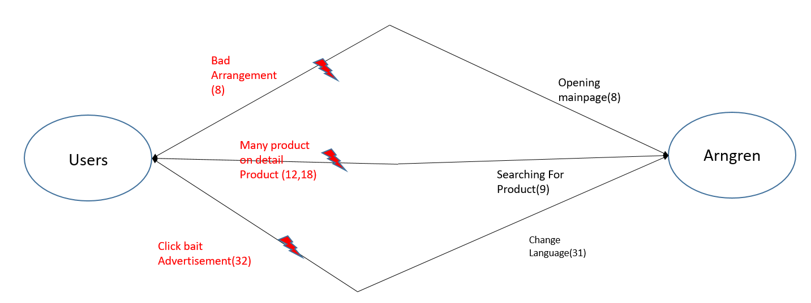

# Contextual Inquiry and Analysis
## Arngreen Description

Arngreen is an advertisement website from large company, Arngren electronics. The products have good quality it is unfortunate that the website doesnt has good looking view. some users even need a lot of time just to finding where is the product they want to buy 

<br>  <br>

## Instruction Script
1. Searching Product
2. opening detail product
3. Finding contact person
4. buying product
5. change Language

## User Description
- Male
- 21 Years old
- universitas Diponegoro Students
- Having Frist time see arngreen

## Transcript
```text
1. Dewang :  Halo nama mu siapa
2. Arip   :  saya arip kak
3. Dewang :  seberapa sering mbuka internet
4. Arip   :  Setiap hari
5. Dewang :  Pernah mbuka arngren belum sebelumnya
6. Arip   :  nope
7. Dewang :  apa pendapatmu tentang website arngreen
8. Arip   :  Berantakan pol apa ini
9. Dewang :  coba cari product yang mbok pengenin
10.Arip   :  la gimana
11.Dewang :  ada tombol search nya itu 
12.arip   :  aaa.. oalah itu di atas
13.Arip   :  yang mana nieh
14.Arip   :  lah kok keluarnya gini
15.Dewang :  di klik lagi coba
16.Arip   :  yang di pencet apa
17.Dewang :  itu pencet gambar nya
18.Arip   :  ini ngga niat jualan apa ya , bikin bingung 
19.Arip   :  kerasa kaya buka Deepweb 
20.Arip   :  Ini cara beli nya gimana ngga bisa langsung ya, ini 
21.Arip   :  gimana seh
22.Arip   :  ini gimana seh ngga kaya shopee gitu
23.Dewang :  ini website buat nampilin product aja , nanti ada 
24.Dewang :  kontak person nya       
25.Dewang :  dibawah buat beli secara manual
26.Dewang :  kamu tau ngga kalo di website ada kategory nya
27.arip   :  la yang mana i 
28.Dewang :  itu dipojok kiri
29.Arip   :  loh bisa dipencet to ternyata , gangerti aku
30.Arip   :  opo ki tambah ga jelas , rakmudeng wes aku
31.Dewang :  tau ngga kalo ada Ganti bahasa di website ini 
32.Arip   :  yang mana sih , oh gambar benedera ni mesti
33.Dewang :  iya pencet coba
34.Arip   :  loh kok malah keluar iklan
35.Arip   :  ini apa sih gajelas 
36.Arip   :  tak kasih bintang 1 di google ntar
37.Dewang :  yaudah emang mbingungin kok , Makasih ya
38.Arip   :  sama sama
``` 

## Models and Annotations
### Artifact Model
<br>  <br>
<br>  <br>
### Flow Model
<br>  <br>
### Cultural Model
<br>  <br>
## Do's
- Arrange the product location
- Remove 3rd app advertisement from product
- Make it arround 10 product per page only
- simpler the category
## Do's
- Don't add another product detail on product description page