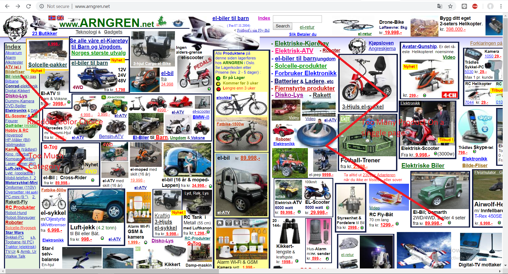
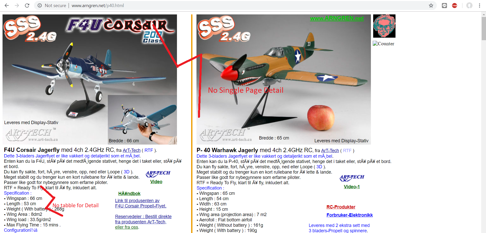
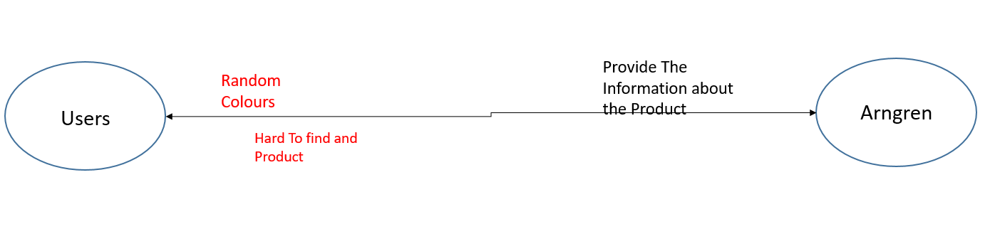

# Contextual Inquiry and Analysis
## Arngreen Description

Arngreen is an advertisement website from large company, Arngren electronics. The products have good quality it is unfortunate that the website doesnt has good looking view. some users even need a lot of time just to finding where is the product they want to buy 

<br>  <br>

## Instruction Script
1. Searching Product
2. opening detail product
3. Finding contact person
4. buying product
5. change Language

## User Description
- Male
- 21 Years old
- universitas Diponegoro Students
- Having Frist time see arngreen

## Transcript
```text
Dewang :  Halo nama mu siapa
Arip   :  saya arip kak
Dewang :  seberapa sering mbuka internet
Arip   :  Setiap hari
Dewang :  Pernah mbuka arngren belum sebelumnya
Arip   :  nope
Dewang :  apa pendapatmu tentang website arngreen
Arip   :  Berantakan pol apa ini
Dewang :  coba cari product yang mbok pengenin
Arip   :  la gimana
Dewang :  ada tombol search nya itu 
arip   :  aaa.. oalah itu di atas
Arip   :  yang mana nieh
Arip   :  lah kok keluarnya gini
Dewang :  di klik lagi coba
Arip   :  yang di pencet apa
Dewang :  itu pencet gambar nya
Arip   :  ini ngga niat jualan apa ya , bikin bingung 
Arip   :  kerasa kaya buka Deepweb 
Arip   :  Ini cara beli nya gimana ngga bisa langsung ya, ini 
Arip   :  gimana seh
Arip   :  ini gimana seh ngga kaya shopee gitu
Dewang :  ini website buat nampilin product aja , nanti ada 
Dewang :  kontak person nya       
Dewang :  dibawah buat beli secara manual
Dewang :  kamu tau ngga kalo di website ada kategory nya
arip   :  la yang mana i 
Dewang :  itu dipojok kiri
Arip   :  loh bisa dipencet to ternyata , gangerti aku
Arip   :  opo ki tambah ga jelas , rakmudeng wes aku
Dewang :  tau ngga kalo ada Ganti bahasa di website ini 
Arip   :  yang mana sih , oh gambar benedera ni mesti
Dewang :  iya pencet coba
Arip   :  loh kok malah keluar iklan
Arip   :  ini apa sih gajelas 
Arip   :  tak kasih bintang 1 di google ntar
Dewang :  yaudah emang mbingungin kok , Makasih ya
Arip   :  sama sama
``` 

## Models and Annotations
### Artifact Model
<br>  <br>
<br>  <br>
### Flow Model

### Cultural Model
<br>  <br>
## Do's
- Arrange the product location
- Remove 3rd app advertisement from product
- Make it arround 10 product per page only
- simpler the category
## Do's
- Don't add another product detail on product description page